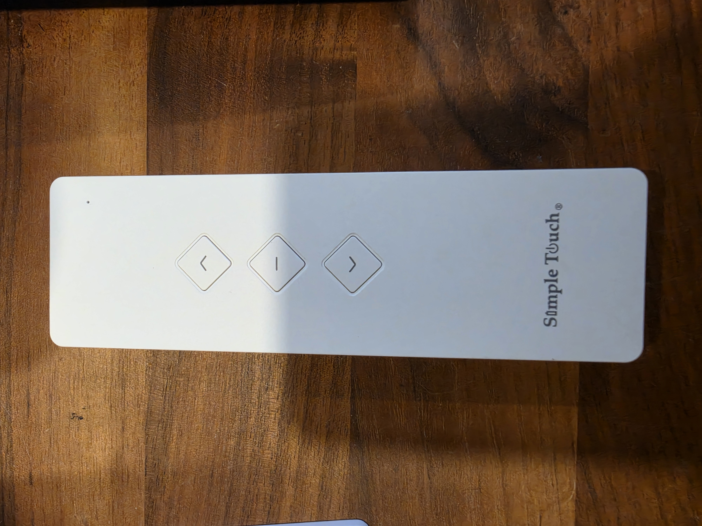
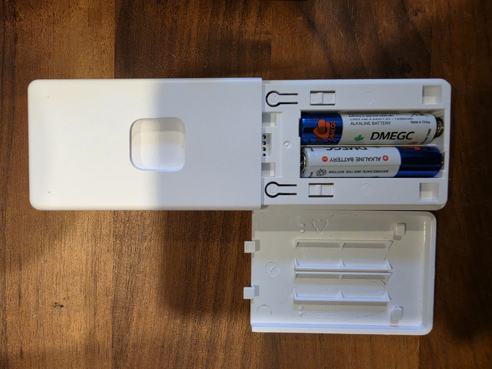

# Set up Simple Touch

[← Overview](../README.md)

## Hardware

### Recognize the tested remote

The verified remote has **Simple Touch** branding, three diamond-shaped Up / Stop / Down buttons, and two **P2** buttons inside the battery compartment. These photos show the actual remote used for testing.

| Front | Battery compartment and P2 buttons |
| --- | --- |
|  |  |

Matching appearance is a useful first check, not proof of RF compatibility. This identifies the tested Simple Touch-branded remote; the original equipment manufacturer is not established by the branding alone. Avoid testing P2 casually: the programming sequence can add or remove a paired remote.

The initial supported board is the **Seeed XIAO ESP32-S3**, with a 433 MHz CC1101 module and suitable antenna. Use 3.3 V power and logic.

| CC1101 | XIAO ESP32-S3 |
| --- | --- |
| VCC | 3V3 |
| GND | GND |
| SCK | D8 / GPIO7 |
| MISO | D9 / GPIO8 |
| MOSI | D10 / GPIO9 |
| CSN | D5 / GPIO6 |
| GDO0 | D2 / GPIO3 |

The XIAO ESP32-S3 has no native Zigbee radio. CC1101 handles the shade's 433 MHz FSK; Wi-Fi connects the bridge to Home Assistant.

## Installation

HACS installs the **Home Assistant integration**, not ESP32 firmware. Install both parts once.

### 1. Install the bridge firmware

Open the [Simple Touch installer](https://spikked27.github.io/Simple-Touch-Home-Assistant/) in desktop Chrome or Edge. You do not need to download this repository, install Arduino tools, or run a web server.

Connect the XIAO using a USB data cable. Close other serial monitors, choose Install, and select its serial port in Chrome or Edge. After flashing, use the installer's Wi-Fi setup to select a 2.4 GHz network. **Visit device** opens the bridge with your session already authorized.

If provisioning fails, open the serial console and send `SETUP`. Join the printed `SimpleTouch-…` Wi-Fi network with the printed password, then open `http://192.168.4.1`. Enter your network in Settings → Wi-Fi. The hotspot closes two minutes after Wi-Fi connects. `INFO` on USB prints the local address and bridge key. Keep the key private.

No shade pairing or movement occurs on boot, firmware installation, or Wi-Fi setup.

**Updating an existing bridge:** from v0.3.0 onward, the bridge page checks for updates when opened and every 30 minutes while open. Click **Update now** on the notification or in **Bridge settings → Firmware updates**. The page downloads the tested release, shows upload progress, and reloads after confirming the restart. Shades, physical links and Wi-Fi settings are retained. Update checks need internet access from your browser; shade control stays local.

**First upgrade from v0.1/v0.2, or manual fallback:** download the [application update](https://spikked27.github.io/Simple-Touch-Home-Assistant/simple-touch-esp32s3-update.bin), then select it under **Bridge settings → Firmware update**. This preserves your Wi-Fi, paired shades and linked remotes. Export a backup first. Do not erase user data or repeat pairing when updating.

### 2. Add a shade

Open the bridge web interface and choose **Add shade**. Name it, then follow the pairing guide:

1. On a physical remote already paired to the target shade, press P2. Wait for one jog.
2. Press P2 again. Wait for one jog.
3. Immediately click **Two jogs — pair now**. The bridge sends its new identity's P2.
4. Confirm the shade jogged twice, then test Open, Stop and Close.

Only the intended shade should be powered during pairing. **The same sequence can remove a paired remote.** The web interface prevents casually sending the pairing packet twice. Deleting a remote from the bridge does not remove it from the motor; export a backup before deleting records you may need again.

### 3. Connect Home Assistant

1. Click **Add to HACS** on the [overview](../README.md), or add this repository manually in HACS as an **Integration**.
2. Download Simple Touch and restart Home Assistant.
3. Open **Settings → Devices & services** and select the discovered **Simple Touch** bridge.
4. Paste its key from **Bridge settings → Home Assistant**. Its address is filled in automatically.

Discovery needs local mDNS connectivity between Home Assistant and the bridge. If your network blocks discovery, use **Add integration → Simple Touch** and enter the local address manually.

The bridge also provides a **Firmware** update entity in Home Assistant. It checks hourly and lets you install firmware from Home Assistant’s Updates screen, even when the bridge webpage is closed. HACS separately handles updates to the Simple Touch integration. These are update-available indicators; phone push notifications require a Home Assistant notification automation.

Paired shades appear as cover entities. Newly paired shades are discovered on the next one-second refresh; commands are sent immediately rather than waiting for that inventory poll. The integration's Configure page and each shade's device page link back to the bridge interface.

Home Assistant must be able to reach the ESP32 on your LAN. Keep the bridge on a trusted network; its bearer-authenticated HTTP API is not intended for direct Internet exposure. Use Home Assistant's own remote access for away-from-home control.

## Performance and reliability

The RF sequence itself takes roughly 0.2–0.45 seconds. The bridge generates it locally and begins transmission without a host-side waveform upload. One radio serializes commands; a second request can wait for the current RF sequence to finish. The UI reports measured transmission duration. Measured local API round trips, including RF transmission completion, were about 0.49–0.52 seconds for Open/Close, 0.39–0.41 seconds for Stop, and 0.27 seconds for Favorite. These are not measurements of motor response time; Network conditions and motor response add to these timings.

Counters are reserved in blocks in NVS before transmission. A restart skips unused values rather than reusing them. At counter exhaustion, commands fail explicitly; they do not silently wrap. The tested motor accepted commands after a restart and counter skip. A backup must not be used on two active bridges with the same remote identities.


## Schedule the favorite position

In a Home Assistant automation, choose **Add action → Simple Touch: Go to favorite position**, then select the shade or shades. Add a time or sunrise trigger as usual. The existing Favorite position button also works with **Button: Press**.

```yaml
action: simple_touch.favorite
target:
  entity_id: cover.living_room_shades
```

This recalls the favorite stored in the motor; it is not necessarily 50%. Percentage positioning is not supported and no slider is advertised.

## Open the bridge locally

**Visit device** opens the webpage without a key prompt when your browser is on the bridge's subnet. Use its local IP address or `.local` hostname. The page obtains its connection key automatically, including after an erase and fresh setup. The key remains available in Settings for Home Assistant setup.

Local-network clients are trusted to manage the bridge. Routed networks and reverse proxies require a key. Control APIs retain bearer authentication; automatic local access rejects foreign Host/Origin headers and does not enable cross-origin access. Home Assistant 2025.10 or newer is required.

## Scheduler Card

[Scheduler Card](https://github.com/nielsfaber/scheduler-card#customize) supports the Favorite action through its `customize` configuration. It does not automatically add custom integration actions to its built-in cover choices. Merge this into your existing card YAML, replacing the entity ID with your Simple Touch shade; repeat the entry for each shade. Keep your existing card options and custom actions.

```yaml
type: custom:scheduler-card
include:
  - cover.living_room_shades
customize:
  cover.living_room_shades:
    actions:
      - service: simple_touch.favorite
        name: Favorite position
        icon: mdi:star
```

The card supplies the chosen entity ID automatically. Favorite is added alongside the standard Open, Close, and Stop actions, without a position slider. This example follows the card's documented custom-action interface; dashboard-specific setup is separate from installing Simple Touch.

## Home Assistant state labels

Home Assistant displays Favorite, Partial, and unknown positions as **Open** (assumed). Inspect `assumed_position` for `favorite`, `partial`, or `unknown`. Opening, Closing, and Closed keep their normal states. An offline bridge remains **Unavailable**. An assumed Open label never promises a fully raised shade or a measured percentage.

## Restart and diagnostics

Use **Bridge settings → Restart bridge**, or the **Restart** button on the Home Assistant bridge device. The interfaces wait for a new boot identity; a request acknowledgement alone is not treated as a confirmed restart. Saved shades, remote links, counters, and Wi-Fi settings are retained. Position is assumed Open in Home Assistant until commands establish another state.

Home Assistant's bridge device includes diagnostic Wi-Fi signal (dBm), IP address, uptime (whole minutes), last reset reason, update status, and Radio problem entities. Radio problem reports initialization failure, not measured RF coverage. FIFO overflow and receive queue drop counters are optional disabled entities. Diagnostics use the existing local poll; uptime changes once a minute, and RSSI is sampled every ten seconds. Update status attributes include upload byte counts and any error. An offline bridge makes diagnostics unavailable.

During a firmware update, Home Assistant pauses inventory polling. Confirmation requires a new boot with the requested version. If an upload fails, check Update status and the installed version before retrying; a restart cannot install an incomplete image. The firmware restart timer is armed only after image validation succeeds.
